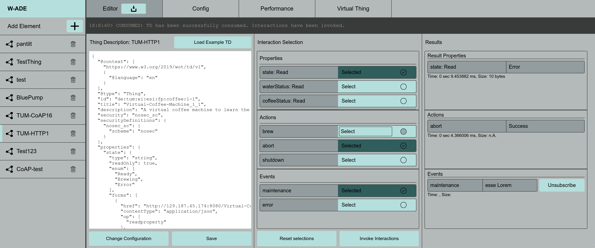
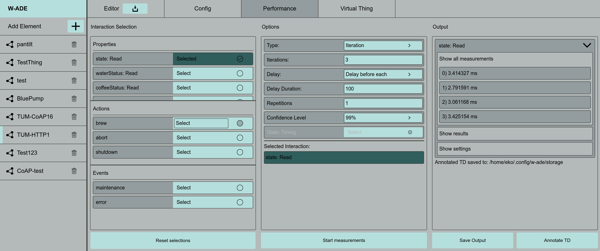
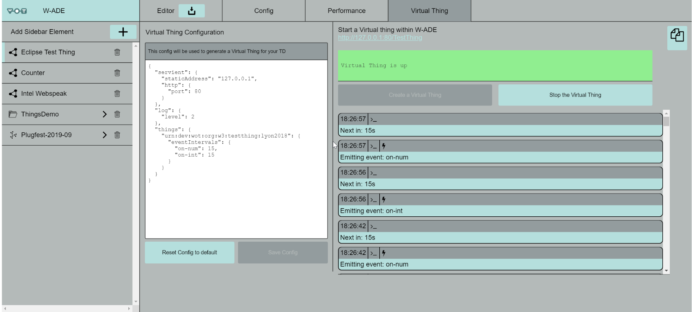

# W-ADE

## Table of Contents  
1. [Web of Things API Development Environment](**W**eb-of-Things-**A**PI–**D**evelopment–**E**nvironment)    
2. [What can you do with W-ADE](#what-can-you-do-with-w-ade)  
3. [Prerequisites](#prerequisites)  
4. [How to Install the Application](#how-to-install-the-application)  
5. [How to Get Started with Development (open in dev mode)](#how-to-get-started-with-development)  
6. [Errors and Known Problems](#errors-and-known-problems)  
7. [Interaction Timing Vocabulary](#interaction-timing-vocabulary)  
8. [Adding or Working on Issues](#adding-or-working-on-issues)

---
## **W**eb of Things **A**PI **D**evelopment **E**nvironment

Wade is an API development environment for Web of Things that was designed for the [W3C WoT building blocks](https://w3c.github.io/wot-architecture/). 
It enables users to interact with IoT devices over various protocols. At the moment the following protocolls are supported: HTTP/HTTPS, CoAP/CoAPS, MQTT.  
It is based on [node-wot](https://www.npmjs.com/org/node-wot), the reference implementation of [W3C's Scripting API](https://w3c.github.io/wot-scripting-api/). 
It is an Electron application.


See the related paper **WADE: Timing Performance Benchmarking in Web of Things**.
```
@inproceedings{skks:2020,    
	  author           = {Verena Eileen Schlott and Ege Korkan and Sebastian Kaebisch and Sebastian Steinhorst},
    title            = {W-ADE: Timing Performance Benchmarking in Web of Things},
    booktitle        = {International Conference on Web Engineering (ICWE 2020)},
    location         = {Helsinki, Finland},
    year             = {2020},
    month            = {6},
    doi				       = {https://doi.org/10.1007/978-3-030-50578-3_6},
    url              = {https://s-steinhorst.github.io/PDF/2020-ICWE-W-ADE%20Timing%20Performance%20Benchmarking%20in%20Web%20of%20Things.pdf},
}
```
---
## What can you do with W-ADE

- Send requests and interact with your IoT device based on its TD

- Test and play around with your [Thing Description](https://w3c.github.io/wot-thing-description/) (TD)
- Save and organize your Thing Descriptions
- Get insights on the timing performance behaviour of interactions

- Retrieve timing performance benchmarks of your requests
- Spin up a [Virtual Thing / Shadow Thing](https://github.com/tum-esi/shadow-thing) based on your TD


---
## Prerequisites

You need to have [Node.js](https://nodejs.org/en/) installed. It is highly recommended to also have [Yarn](https://yarnpkg.com/) installed

---
## How to install the application

**Step 1:** Clone the repository to your local machine.

## Known Problems
- [Install node-aead-crypto to avoid failing dev build and build](https://github.com/tum-esi/wade/issues/9),
   because coap-binding seems to need it might be necessary (it isn't installed
   with current node version because it shouldn't be needed anymore):  
  ```
  npm install -f node-aead-crypto
  ```  
  After installing node-aead-crypto you should delete the dependency from your package.json, so it isn't added to the wade package on the next commit. Also installing a previous "node" version could solve the problem (but
  comes with other disadvantages).
- The [Shadow Thing](https://github.com/tum-esi/shadow-thing) packet needs to be installed locally (not just a symlink in ./node_modules/) in order to work in the production build, and it has to be installed manually anyway if you want to make **Virtual Thing** work in WADE. The reason therefore is, that automatic installation of virtual thing fails under windows and so would
the installation of WADE if Virtual Thing was added to the packet.
- Vuex version 3.1.2 leads to build problems -> [Issue 10](https://github.com/tum-esi/wade/issues/10)

## Project setup
```
git clone https://github.com/tum-esi/wade.git
```

**Step 2:** Navigate into the main folder and install all dependencies.

```
cd wade
yarn install 
```


**Step 3:** Check if `./node_modules/@node-wot/core/dist/servient.js` contains `var vm2_1 = require("vm2");` in line 3. If so, please remove line 3 and lines 15-68.

**Step 4:** Build the electron application. (_If you run into any errors, check here: [Errors and Known Problems](#errors-and-known-problems)_)

```
yarn run electron:build
```

**Step 5:** Navigate into the folder 'dist_electron' and install the application. After installing it you can start the application on your machine.

---
## How to get started with development

(To be able to easily work and develop functionalities in W-ADE, please read the [architecture documentation](https://github.com/tum-esi/wade/blob/master/docs/ARCHITECTURE.md) first!)

After cloning the repository and installing all node dependencies (see step 1 & 2 in [How to Install the Application](#how-to-install-the-application)) do **not** build the app (step 3) but run it in development mode instead:

```
yarn run electron:serve
```
This allows for hot-reloads and shows you all potential errors.  
_If you have problems performing this step or run into an error, check the [Errors and Known Problems](#errors-and-known-problems) section for help._

If you want to add your changes to W-ADE, please fork the repository and create a pull request.  
Also checkout the [Adding or Working on Issues](#adding-or-working-on-issues) section.

---
## Errors and Known Problems

- If you already downloaded the W-ADE repository earlier and have problems with either installing the node dependencies or building the application. Delete the node_modules folder and install/ build the application again.

- 
  ```
  cd wade 
  rm -r -f node_modules
  yarn install 
  yarn run electron:build
  ```

- [Install node-aead-crypto to avoid failing dev build and build](https://github.com/tum-esi/wade/issues/9),
   because coap-binding seems to need it might be necessary (it isn't installed
   with current node version because it shouldn't be needed anymore):

  ```
  npm install -f node-aead-crypto
  ```

  After installing node-aead-crypto you should delete the dependency from your package.json, so it isn't added to the wade package on the next commit. Also installing a previous "node" version could solve the problem (but
  comes with other disadvantages).

- The [*Shadow Thing*](https://github.com/tum-esi/shadow-thing) package needs to be installed locally (not just a symlink in ./node_modules/) in order to work in the production build, and it has to be installed manually anyway if you want to make **Virtual Thing** work in WADE. The reason therefore is, that automatic installation of shadow thing fails under windows and so would the installation of WADE if Shadow Thing was added to the package.json.

- Vuex version 3.1.2 leads to build problems -> [Issue 10](https://github.com/tum-esi/wade/issues/10)

---
## Interaction Timing Vocabulary

To be able to add measured timing performance benchmarks to a Thing Description, a vocabulary set that is aligned with the current Thing Description was developed.   
It is called **Interaction Timing Vocabulary**.   
It's schema can be found in '/interaction-timing-vocabulary'.

## A-MaGe
---
### **A**tomic **Ma**shup **Ge**nerator for the Web of Things
A-MaGe is a mashup generator for the Web of Things designed to take advantage of the Atomic Mashup abstraction proposed by the [System Description](https://ieeexplore.ieee.org/abstract/document/9191677).
See the related paper **A-MaGe: Atomic Mashup Generation for the Web of Things**

```
@inproceedings{ksks:2020,    
    author           = {Ege Korkan and Fady Salama and Sebastian Kaebisch and Sebastian Steinhorst},
    title            = {A-MaGe: Atomic Mashup Generator for the Web of Things},
    booktitle        = {2021 International Conference on Web Engineering (ICWE)},
    location         = {Biarritz, France},
    year             = {in press}
}

```


---
### Prerequisites
For NLP:  
Latest version of [Python](https://www.python.org/) and the following packages
1. [gensim](https://radimrehurek.com/gensim/)
2. [Flask](https://flask.palletsprojects.com/en/1.1.x/)
3. [Flask-RESTful](https://flask-restful.readthedocs.io/en/latest/)

---
 To run the NLP-Sever, run the Python script `./NLP/word2vec-api.py`

---
## Adding or Working on Issues

### Adding Issues
When adding a new issue, please...
1) Use the following **title style**:

    ```
    [<Topic>] <short description of issue>
    ```
    E.g.: [Sidebar] Improve UX of sidebar

2) Add a **priority label** to indicate the importance of the issue.   

    Existing priority labels are: 
      - prio-low
      - prio-mid
      - prio-high.

3) Add a label indicating the **type** of the issue.   

    Existing type labels are: 
    - Bug
    - Enhancement (A new feature or functionality)
    - Improvement (Improvement of existing features/ functionality)

4) Add it to an **Overview-Ticket** (that fits best)  
    Existing overview-tickets are: 
    - [[Sidebar]](https://github.com/tum-esi/wade/issues/57)
    - [[[Benchmarking / Timing Performance] Overview Ticket]](https://github.com/tum-esi/wade/issues/61)
    - [[General]](https://github.com/tum-esi/wade/issues/56)
    - [[UI]](https://github.com/tum-esi/wade/issues/54)
    - [[Thing Description Interface]](https://github.com/tum-esi/wade/issues/52)
    - [[Virtual Thing Plugin]](https://github.com/tum-esi/wade/issues/51)


### Working on Issues

When you want to work on an issue, please ... 

1) Assign issue to yourself: So that multiple persons aren't working on the same issue.

2) Create a new branch, and use the following naming convention:   
    ```
    <type-of-issue>-<topic>-<short-description>
    ```
    _type-of-issue_ refers to this:   
    E.g. _bugfix-sidebar-click-error_ or _improvement-ui-better-zooming_

3) Link the according issue in the pull request: When finishing the issue and when creating a pull-request to master, link the issue. The person who merges the pull-request to master can then close the issue.

4) Closed issue also needs to be striked-through on the according overview-issue.